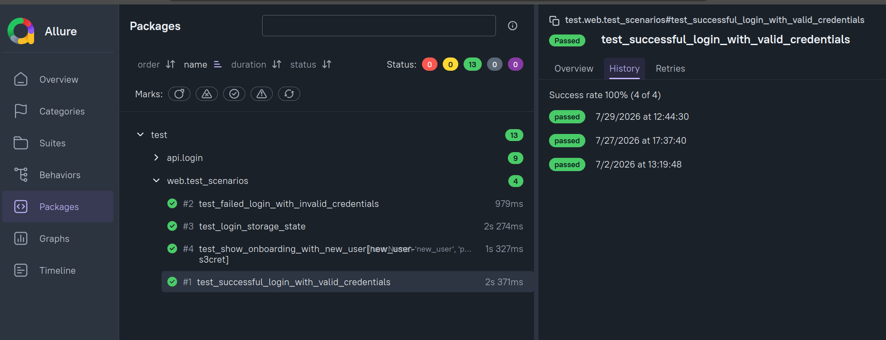

# 🎭 Playwright Automation Framework

[](https://playwright.dev/python/)
[](https://www.python.org/)
[](https://docs.pytest.org/)
[](https://pytest-bdd.readthedocs.io/)
[](https://allurereport.org/)
[](https://github.com/features/actions)


## Overview
This test automation framework combines Playwright, pytest, and pytest-bdd to create a comprehensive solution for testing web applications. 
This project uses as example the Cypress Real World App, a popular open-source project that provides a realistic web application for testing purposes. 

## Key Features

- **Hybrid test strategy** — Web UI with pytest-bdd (Gherkin) and API tests with plain pytest
- **Page Object Model** — Locators, actions, and assertions isolated from step definitions
- **Thin BDD steps** — Steps only orchestrate; all Playwright logic lives in page objects
- **Resilient locators** — Prefer `get_by_role` and `get_by_test_id` (`data-test`) (modified playwright configuration)
- **Auth state reuse** — Login once, persist `storage_state` under `.auth/` for faster scenarios
- **Test data seeding** — Using class `UserBuilder` to create users via API 
- **Test isolation** — `@reset_db` marker reseeds the database after tagged scenarios
- **Centralized config** — Base URLs and seed users via env vars / `config/`
- **CI/CD pipeline** — GitHub Actions runs API + Web suites
- **Reporting** — Allure reports published to GitHub Pages; Playwright traces on failure
- **BDD skills** — Skill to convert specification in natural language into framework-compliant tests

##  Tech Stack

| Technology             | Purpose                                                |
|:-----------------------|:-------------------------------------------------------|
| **Playwright**         | E2E test runner and automation library                 |
| **Requests**           | API testing and backend test setup                     |
| **Python**             | Primary programming language                           |
| **Gherkin (Cucumber)** | BDD syntax for writing test scenarios                  |
| **Git/GitHub**         | Version control and project hosting                    |
| **Github Actions**     | Continuous integration pipeline                        |
| **Github Pages**       | Artifact repository for Alure reports                  |
| **Pytest**             | Test runner and orquestation                           |
| **pytest-bdd**         | BDD integration with Gherkin scenarios                 |
| **pytest-playwright**  | Browser fixtures and Playwright integration for pytest |

## Allure reports

Allure reports are generated and published in https://codecaballero.github.io/python-playwright/



## Installation

### Prerequisites

| Tool    | Version |
|:--------|:--------|
| Python  | 3.12+   |
| Node.js | 22+     |
| Yarn    | latest  |

The app under test must be available at:

- **Web:** `http://localhost:3000`
- **API:** `http://localhost:3001`
- 
### 0. Prerequisites
- Python 3.12 or higher
- [uv](https://github.com/astral-sh/uv) installed
### 1. Clone this repository

```bash
git clone https://github.com/CodeCaballero/python-playwright.git
cd python-playwright
```

### 2. Create a virtual environment and install dependencies

```bash
uv sync
uv run playwright install chromium
uv run pytest
```

### 3. Start the Cypress Real World App

In a separate terminal:

```bash
git clone https://github.com/CodeCaballero/cypress-realworld-app.git app
cd app
yarn install --frozen-lockfile
yarn db:seed:dev
yarn dev
```

Wait until both `http://localhost:3000` and `http://localhost:3001` respond.

### 4. Environment variables

Defaults are set in `pyproject.toml`:

| Variable       | Default                 |
|:---------------|:------------------------|
| `WEB_BASE_URL` | `http://localhost:3000` |
| `API_BASE_URL` | `http://localhost:3001` |

Override them when needed:

```bash
WEB_BASE_URL=http://localhost:3000 API_BASE_URL=http://localhost:3001 pytest
```

### 5. Run the tests

```bash
# Full suite
pytest -v

# API only
pytest test/api/ -v

# Web (BDD) only
pytest test/web/ -v

# With Allure results
pytest -v --alluredir=allure-results
allure serve allure-results

# Playwright traces on failure
pytest test/web/ -v --tracing=retain-on-failure
```
